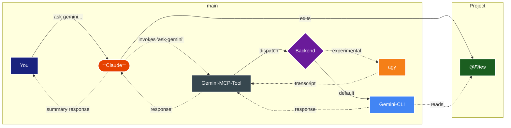

# How It Works

## Natural Language Workflow Integration

The gemini-mcp-tool is designed to seamlessly integrate into your natural workflow with your preferred MCP compliant AI clients, achieved through carefully crafted tools and pipelines.

Claude automatically decides when to use `ask-gemini` based on context:

- `🔍 comparative analysis` - different AI perspectives for validation
- `🛠️ leveraging extra tools` - Gemini's search and memory functions  
- `📋 code review & big changes` - second opinions on implementation
- `💡 creative problem solving` - brainstorming and ideation

This intelligent selection enhances your workflow exactly when Gemini's capabilities add value.

⇣ when ask-gemini gets called ↴

<DiagramModal>

```mermaid
---
config:
  flowchart:
    htmlLabels: false
    curve: cardinal
---
flowchart LR
    subgraph main
        direction TB
        A[You] --> |"ask gemini..."| B([**Claude**])
        B -.-> |"invokes 'ask-gemini'"| C["Gemini-MCP-Tool"]
        C --> |"dispatch"| D{"Backend"}
        D --> |"default"| E[Gemini-CLI]
        D -.-> |"experimental"| F["agy"]
        E e1@-.-> |"response"| C
        F -.-> |"transcript"| C
        C -.-> |"response"| B
        B -.-> |"summary response"| A
        e1@{ animate: true }
    end
    subgraph Project
        B --> |"edits"| G["`**@*Files***`"]
        E -.-> |"reads"| G
    end
    classDef userNode fill:#1a237e,stroke:#fff,color:#fff,stroke-width:2px
    classDef claudeNode fill:#e64100,stroke:#fff,color:#fff,stroke-width:2px
    classDef geminiNode fill:#4285f4,stroke:#fff,color:#fff,stroke-width:2px
    classDef mcpNode fill:#37474f,stroke:#fff,color:#fff,stroke-width:2px
    classDef dataNode fill:#1b5e20,stroke:#fff,color:#fff,stroke-width:2px
    classDef dispatchNode fill:#6a1b9a,stroke:#fff,color:#fff,stroke-width:2px
    classDef agyNode fill:#f57f17,stroke:#fff,color:#fff,stroke-width:2px
    class A userNode
    class B claudeNode
    class C mcpNode
    class D dispatchNode
    class E geminiNode
    class F agyNode
    class G dataNode
```
</DiagramModal>

## Architecture <Badge text="1.2.0" type="tip" />

Starting with v1.2.0, the MCP server uses a **pluggable backend** architecture:

1. **Your MCP client** (Claude Code, Claude Desktop, etc.) sends a tool call via stdio
2. **gemini-mcp-tool** validates arguments, applies security guards (`@file` containment, approval mode), and routes the prompt through the selected backend
3. **The backend** (Gemini CLI by default, Antigravity CLI when opted in) spawns the CLI, handles stdin/stdout, and returns the model response
4. **The MCP server** formats the response and sends it back to your client

### Key Components

| Component | What it does |
|-----------|-------------|
| `commandExecutor` | Spawns CLI processes with Windows quoting, timeout/kill, ENOENT guidance |
| `geminiExecutor` | Security guards, changeMode templating, backend dispatch |
| `backends/gemini` | Builds Gemini CLI args, handles quota fallback (Pro → Flash) |
| `backends/agy` | Experimental Antigravity CLI with transcript-file recovery |
| `timeoutManager` | Configurable per-call timeout (SIGTERM → SIGKILL) |

### Security

- **CVE-2026-0755**: `@file` references are checked to stay within the project directory before being sent to any CLI
- **CWE-22**: `chunkCacheKey` is validated against a strict hex format
- **Windows injection**: All arguments are quoted for `cmd.exe` even without whitespace, neutralising `& | < > ^ ( )` metacharacters
