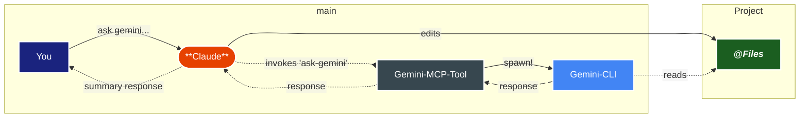

# How It Works

## Natural Language Workflow Integration

The gemini-mcp-tool is designed to seamlessly integrate into your natural workflow with your preferred MCP compliant AI clients, achieved through carefully crafted tools and pipelines.

Claude automatically decides when to use Gemini tools based on context:

**`ask-gemini` for Analysis & Review:**
- `🔍 comparative analysis` - different AI perspectives for validation
- `🛠️ leveraging extra tools` - Gemini's search and memory functions  
- `📋 code review & big changes` - second opinions on implementation
- `📚 large file analysis` - leveraging Gemini's massive token window

**`brainstorm` for Creative Ideation:**
- `💡 structured idea generation` - using proven creative methodologies
- `🎯 context-aware brainstorming` - domain-specific insights and constraints
- `⚡ rapid ideation` - quick creative sessions with progress tracking
- `🔄 iterative refinement` - building on previous brainstorming sessions

This intelligent tool selection enhances your workflow exactly when each AI's specialized capabilities add value.

⇣ when ask-gemini gets called ↴

<DiagramModal>

</DiagramModal>
