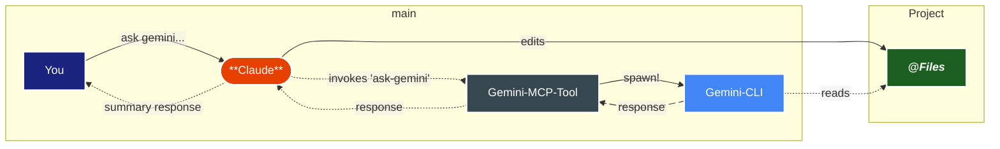

# Getting Started

This guide will help you get up and running with an. y MCP-compatible client.

:::warning 💡 For quick start instruction, please refer to our [**TLDR**](https://github.com/jamubc/gemini-mcp-tool#readme).
:::

## Choose Your Client

<ClientGrid>
  <div class="client-card client-card--recommended">
    <h3>💻 Claude Code</h3>
    <div class="client-badge">Power Users</div>
    <p>One-command setup</p>
    <a href="#claude-code-recommended" class="client-button">Get Started →</a>
  </div>
  
  <div class="client-card">
    <h3>🖥️ <br>Claude Desktop</h3>
    <div class="client-badge">Everyday users</div>
    <p>JSON configuration</p>
    <a href="#claude-desktop" class="client-button">Setup Guide →</a>
  </div>
  
  <div class="client-card">
    <h3>📂 Other Clients</h3>
    <div class="client-badge">40+ Options</div>
    <p>Continue, Cody, Cursor, Zed, Warp</p>
    <a href="#other-mcp-clients" class="client-button">View Options →</a>
  </div>
</ClientGrid>

---
#### How does *Gemini-MCP-Tool* work?
<DiagramModal>


</DiagramModal>

Claude uses MCP protocol to invoke tools on our server, which calls Gemini to analyze your files and suggest edits. Files are processed locally and never stored or shared.

## Choose Your Setup

::: warning 💡 gemini-mcp-tool is tested extensively with claude code
:::

## TLDR Quick Start

**Claude Code (Recommended):**

<CodeBlock 
  language="bash"
  code="claude mcp add gemini-cli -- npx -y gemini-mcp-tool
claude code  # You're ready!"
/>

**Any Other MCP Client:**
1. Install [Gemini CLI](https://github.com/google-gemini/gemini-cli)
2. Add MCP server config (see patterns below)
3. Use natural language: "use gemini to analyze this file"

## Prerequisites

Before installing, ensure you have:

- **[Node.js](https://nodejs.org/)** v16.0.0 or higher
- **[Google Gemini CLI](https://github.com/google-gemini/gemini-cli)** installed and configured on your system
- **Claude Desktop** or **Claude Code** with MCP support

### Quick Install [Gemini CLI](https://github.com/google-gemini/gemini-cli)

<CodeBlock 
  language="bash"
  code="npm install -g @google/gemini-cli
gemini #run gemini and complete auth"
/>

## Installation Methods

### Method 1: Using npx (Recommended - No Installation!)

This is the simplest approach - no global installation needed:

```json
{
  "mcpServers": {
    "gemini-cli": {
      "command": "npx",
      "args": ["-y", "gemini-mcp-tool"]
    }
  }
}
```

### Method 2: Global Installation

If you prefer a traditional global install:

```bash
# Install globally
claude mcp add gemini-cli -- npx -y gemini-mcp-tool

# Then use this configuration:
```

```json
{
  "mcpServers": {
    "gemini-cli": {
      "command": "gemini-mcp"
    }
  }
}
```

## Configuration File Locations

Find your Claude Desktop configuration file:

- **macOS**: `~/Library/Application Support/Claude/claude_desktop_config.json`
- **Windows**: `%APPDATA%\Claude\claude_desktop_config.json`
- **Linux**: `~/.config/claude/claude_desktop_config.json`

::: tip
After updating the configuration, restart Claude Desktop completely for changes to take effect.
:::

## Claude Code (Recommended)

Claude Code offers the smoothest experience.

```bash
# install for claude code
claude mcp add gemini-cli -- npx -y gemini-mcp-tool

# Start Claude Code - it's automatically configured!
claude code
```

## Claude Desktop

For Claude Desktop users, add this to your configuration file:

```json
{
  "mcpServers": {
    "gemini-cli": {
      "command": "npx",
      "args": ["-y", "gemini-mcp-tool"]
    }
  }
}
```

## Other MCP Clients

Gemini MCP Tool works with 40+ MCP clients! Here are the common configuration patterns:

### STDIO Transport (Most Common)
```json
{
  "transport": {
    "type": "stdio",
    "command": "npx",
    "args": ["-y", "gemini-mcp-tool"]
  }
}
```

### Popular Clients

<details>
<summary><strong>Continue.dev</strong> - VS Code extension with full MCP support</summary>

**Configuration Location:** `~/.continue/config.json`

```json
{
  "experimental": {
    "modelContextProtocolServer": {
      "transport": {
        "type": "stdio",
        "command": "npx",
        "args": ["-y", "gemini-mcp-tool"]
      }
    }
  }
}
```

**Usage:** Type `@` → select "MCP" → choose resource for context

</details>

<details>
<summary><strong>Cody</strong> - Sourcegraph's AI assistant with OpenCtx integration</summary>

**Configuration Location:** VS Code `settings.json`

```json
{
  "openctx.providers": {
    "https://openctx.org/npm/@openctx/provider-modelcontextprotocol": {
      "nodeCommand": "npx",
      "mcp.provider.args": ["-y", "gemini-mcp-tool"]
    }
  }
}
```

**Setup:** Enable OpenCtx in Cody Settings → check "OpenCtx: Enable"

</details>

<details>
<summary><strong>Cursor</strong> - AI-powered code editor with built-in MCP</summary>

**Configuration Location:** Settings → Cursor Settings → MCP servers

**Project Config:** Create `.cursor/mcp.json` in project root:

```json
{
  "mcpServers": {
    "gemini-cli": {
      "command": "npx",
      "args": ["-y", "gemini-mcp-tool"]
    }
  }
}
```

**Features:** One-click MCP installation, OAuth support, up to 40 tools

</details>

<details>
<summary><strong>Zed</strong> - High-performance editor with native MCP</summary>

**Configuration Location:** `settings.json`

```json
{
  "context_servers": {
    "gemini-cli": {
      "source": "custom",
      "command": "npx",
      "args": ["-y", "gemini-mcp-tool"]
    }
  }
}
```

**Features:** MCP extensions, custom slash commands, Extension Store integration

</details>

<details>
<summary><strong>TypingMind</strong> - Web-based AI interface with plugin system</summary>

**Configuration Location:** Settings → Advanced Settings → Model Context Protocol

**Setup Steps:**
1. Navigate to MCP settings
2. Add server configuration
3. Enable in Plugins page
4. Assign to AI agents as needed

**Features:** Enable/disable tools via interface, assign to AI agents, custom icons

</details>

<details>
<summary><strong>Warp</strong> - Modern terminal with AI features</summary>

**Configuration Location:** Terminal Settings → AI Settings → MCP Configuration

```json
{
  "gemini-cli": {
    "command": "npx",
    "args": [
      "-y",
      "gemini-mcp-tool"
    ],
    "env": {},
    "working_directory": null,
    "start_on_launch": true
  }
}
```

**Features:** Terminal-native MCP integration, AI-powered command suggestions

</details>

### Generic Setup Steps
1. **Install Prerequisites**: Ensure [Gemini CLI](https://github.com/google-gemini/gemini-cli) is installed
2. **Add Server Config**: Use the STDIO transport pattern above
3. **Restart Client**: Most clients require restart after config changes
4. **Test Connection**: Try `/gemini-cli:ping` or natural language commands

## Verify Your Setup

Once configured, test that everything is working:

### 1. Basic Connectivity Test
Type in Claude:
```
/gemini-cli:ping "Hello from Gemini MCP!"
```

### 2. Test File Analysis
```
/gemini-cli:analyze @README.md summarize this file
```

### 3. Test Sandbox Mode
```
/gemini-cli:sandbox create a simple Python hello world script
```

## Quick Command Reference

Once installed, you can use natural language or slash commands:

### Natural Language Examples
- "use gemini to explain index.html"
- "understand the massive project using gemini"
- "ask gemini to search for latest news"

### Slash Commands in Claude Code
Type `/gemini-cli` and these commands will appear:
- `/gemini-cli:analyze` - Analyze files or ask questions
- `/gemini-cli:sandbox` - Safe code execution
- `/gemini-cli:help` - Show help information
- `/gemini-cli:ping` - Test connectivity

## Need a Different Client?

Don't see your MCP client listed? Gemini MCP Tool uses standard MCP protocol and works with any compatible client.

::: tip Find More MCP Clients
- **Official List**: [modelcontextprotocol.io/clients](https://modelcontextprotocol.io/clients)
- **Configuration Help**: Most clients follow the STDIO transport pattern above
- **Community**: Join discussions on GitHub for client-specific tips
:::

## Common Issues

### "Command not found: gemini"
Make sure you've installed the Gemini CLI:
```bash
npm install -g @google/gemini-cli
```

### "MCP server not responding"
1. Check your configuration file path
2. Ensure JSON syntax is correct
3. Restart your MCP client completely
4. Verify Gemini CLI works: `gemini -help`

### "Permission denied"
On macOS/Linux, you might need to make scripts executable:
```bash
chmod +x contribution/*.sh
```

### Client-Specific Issues
- **Continue.dev**: Configuration goes in `experimental` section
- **Claude Desktop**: Must restart completely after config changes
- **Other Clients**: Check their specific documentation for MCP setup

## Next Steps

Now that you're set up:
- Learn about file analysis with @ syntax
- Explore sandbox mode for safe code execution
- Check out real-world examples in the README
- Join the community for support

::: info Need Help?
If you run into issues, [open an issue](https://github.com/jamubc/gemini-mcp-tool/issues) on GitHub.
:::