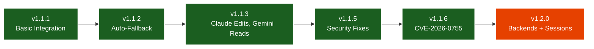
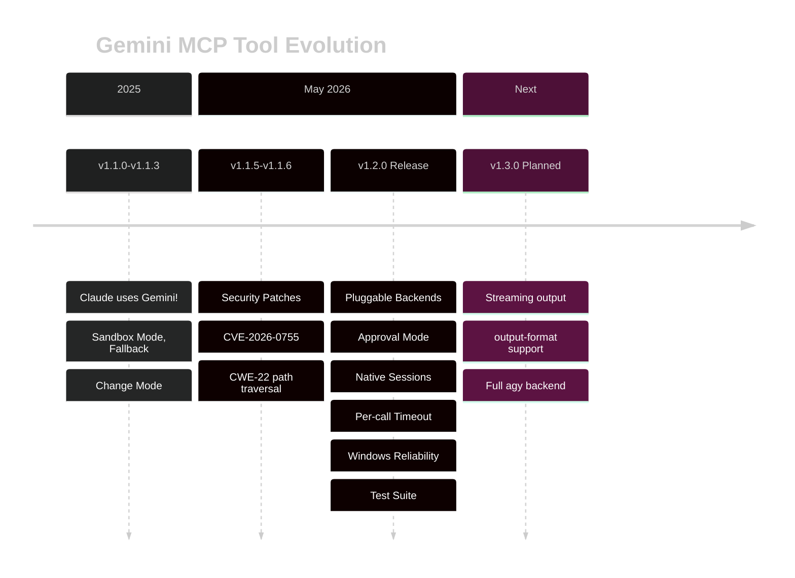

# Roadmap

## Evolution

<DiagramModal>

</DiagramModal>

## Timeline

<DiagramModal>

</DiagramModal>

## What's Next

### v1.3.0 (Planned)
- **Streaming output** — `--output-format stream-json` for real-time progress
- **Full agy backend** — once the `agy -p` stdout bug is fixed upstream
- **ACP persistent process** — reuse a long-lived agy process for performance

### Open PRs (separate merges)
- **#65** — MCP SDK modernization + OAuth
- **#44** — LRU cache for performance
- **#46** — Tool annotations
- **#50** — Native session-id resume (partially landed in 1.2.0)
- **#35** — Gemini schema compatibility